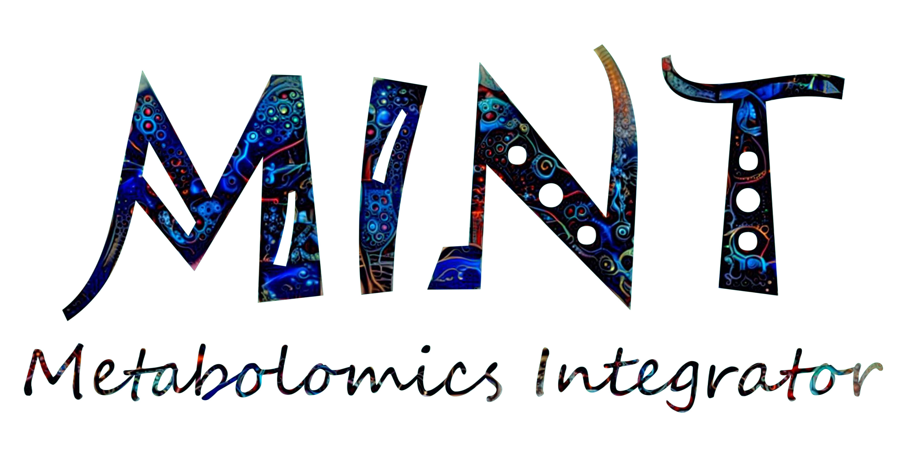
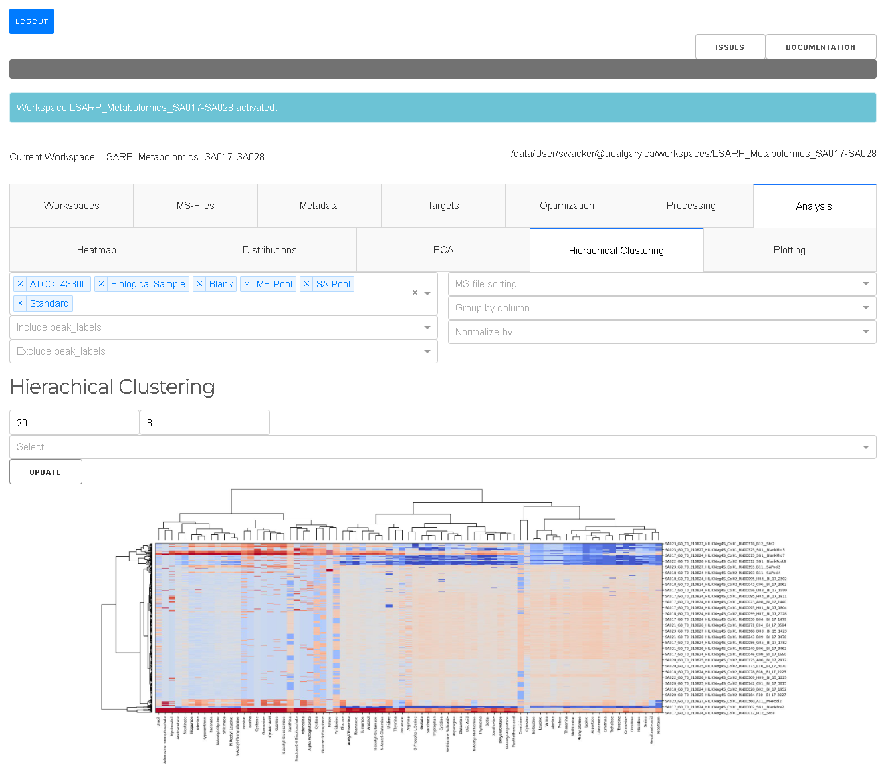

# MINT (Metabolomics Integrator)

The Metabolomics Integrator (MINT) is a post-processing tool for liquid chromatography-mass spectrometry (LCMS) based metabolomics. 
Metabolomics is the study of all metabolites (small chemical compounds) in a biological sample e.g. from bacteria or a human blood sample. 
The metabolites can be used to define biomarkers used in medicine to find treatments for diseases or for the development of diagnostic tests 
or for the identification of pathogens such as methicillin resistant _Staphylococcus aureus_ (MRSA). 
More information on how to install and run the program can be found in the [Documentation](https://LewisResearchGroup.github.io/ms-mint-app/) or check out the 
[Tutorial](https:///LewisResearchGroup.github.io/ms-mint-app/quickstart/) to jump right into it.

## News
MINT has been split into the Python library and the app. This repository contains the Python library. The underlying Python library `ms-mint` can be found [here](https://github.com/LewisResearchGroup/ms-mint).

## Screenshot

# Quickstart

## Try it

A demo server is available [here](https://mint.resistancedb.org). Be mindful, you share the server with others.
  
## Installation

The recommended way of installing Mint is to use `pip`:

    pip install ms-mint-app
    
Then you can start the application with:

    Mint.py  # This starts the application

Once the server has started navigate to http://localhost:9999 with your browser (tested on Chrome).

There are more options available:

    Mint.py --help
    >>>
    usage: Mint.py [-h] [--no-browser] [--version] [--data-dir DATA_DIR] [--debug] [--port PORT] [--host HOST]
                   [--serve-path SERVE_PATH] [--ncpu NCPU]

    MINT frontend.

    options:
      -h, --help            show this help message and exit
      --no-browser          do not start the browser
      --version             print current version
      --data-dir DATA_DIR   target directory for MINT data
      --debug               start MINT server in debug mode
      --port PORT           Port to use
      --host HOST           Host binding address
      --ncpu NCPU           Number of CPUs to use  # Not yet implemented

## Windows installer

  The latest Windows installer is available [here](https://github.com/LewisResearchGroup/ms-mint-app/releases/tag/v0.1.7.6).

## Contributions
All contributions, bug reports, code reviews, bug fixes, documentation improvements, enhancements, and ideas are welcome.
Before you modify the code please reach out to us using the [issues](https://github.com/LewisResearchGroup/ms-mint/issues) page.

## Code standards
The project follows PEP8 standard and uses Black and Flake8 to ensure a consistent code format throughout the project.

## Get in touch
Open an [issue](https://github.com/LewisResearchGroup/ms-mint-app/issues) or join the [slack](https://ms-mint.slack.com/) channel.

# Acknowledgements
This project would not be possible without the help of the open-source community. 
The tools and resources provided by GitHub, Docker-Hub, the Python Package Index, as well the answers from dedicated users on [Stackoverflow](stackoverflow.com)
and the [Plotly community](https://community.plotly.com/), as well as the free open-source packages used are the foundation of this project.
Several people have made direct contributions to the codebase and we are extremely grateful for that. 

- @rokm refactored the specfile for `Pyinstaller` to create a windows package. 
- @bucknerns helped with the configuration of the `versioneer` file.

Last but not least, we want to thank all the users and early adopters that drive the development with feature requests and bug reports.

