# MINT GUI

## Workspaces

  - Add new workspaces
  - Delete workspaces
  - Activate workspace 

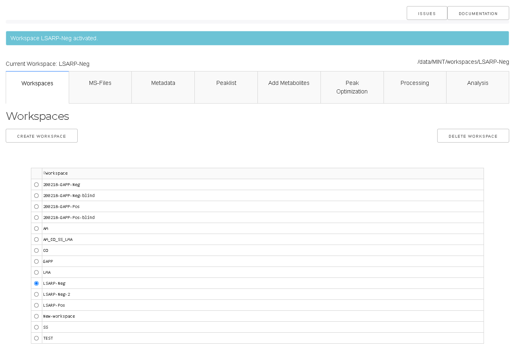

A workspace is a container for project files that is separated from other workspaces. Through workspaces it is possible to work on different projects simultaneously. 
All files relevant for one workspace are stored in a corresponding sub-folder of `--data-dir`, which by default is the folder MINT in the users home directory. 
The home directory is different on different platforms. Under Windows the default folder is: `C:/Users/<username>/MINT`. 
The path to the active workspace is always displayed above the workspace tab.

To activate a particular workspace the workspace has to be selected in the table and then the `ACTIVATE` button has to be clicked. 
`DELETE` will display a popup window upon confirmation the selected workspace with all corresponding files on the harddrive in `--data-dir` will be removed. 

## MS-files

  - Import mass spectrometry files (MS-file) in mzXML or mzML format
  - Convert file to feather format (other formats will be removed)
  - Remove MS-files from workspace

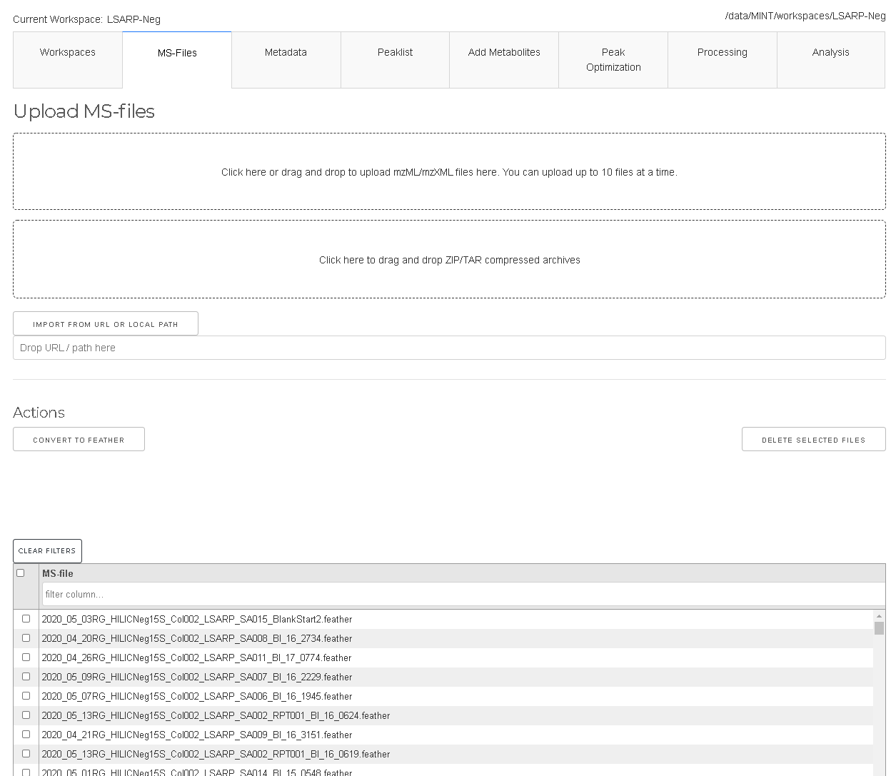

Mass-Spec files (in _mzML_ or _mzXML_ format) can be added under the `MS-files` tab by drag and drop or by using the selection form. 
Due to limitations of the Plotly-Dash framework only up to 10 files can be uploaded at a time. For larger projects, the files can simply 
be copied manually into the ms-files subdirectory. This will be improved in future versions of MINT. 

To remove certain files the files have to be selected in the table and the `DELETE SELECTED FILES` has to be clicked.

The files are converted to `feather` format which is based on Apache Arrow. It is a representation that allows faster read into memory.
If files were added manually by copying into the ms-files subdirectory the files can be converted to feather format with the `CONVERT TO FEATHER` button.
Note that _mzXML_ and _mzML_ files will be deleted after convertion. 

## Metadata
- Select samples used for peak optimization by setting values in the column `PeakOpt` to `True`.
- Add batch labels to analyse for possible batch effects.
- Add labels to analyse for differences of different groups (e.g. treatment and control)
- Add types for different files e.g. biological sample, quality control sample, standards etc in order to include or exclude certain types during analysis.
- Add other types of metadata. 

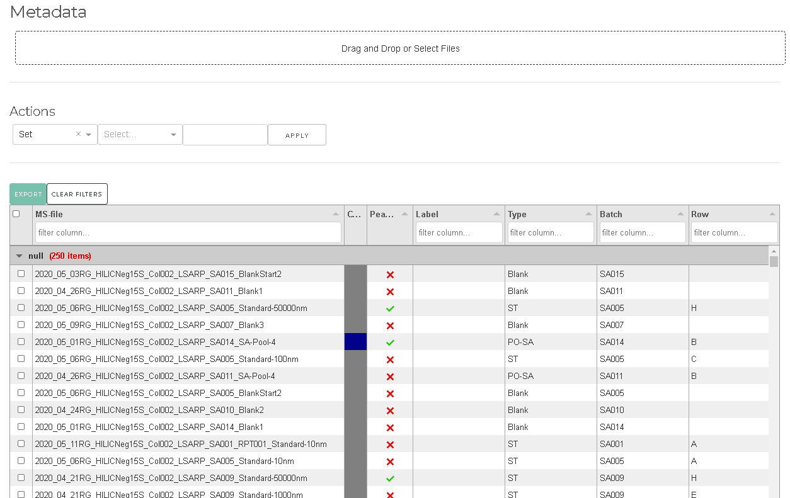

Metadata for the individual files can be edited in the `Metadata` tab. This data can be used to group results e.g. by batch or by label as well as types.
You want to edit metadata table to:

## Targetlists

- Import peaklist from CSV file or add new peaks manually
- Rename peaks definitions or change parameters
- Delete peak definitions

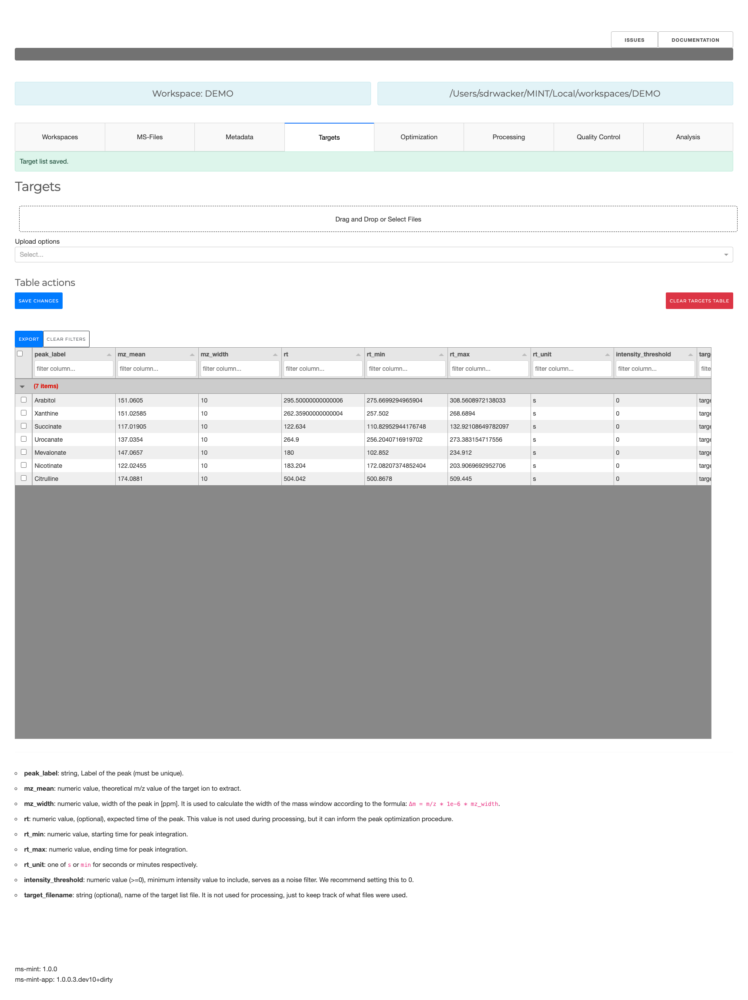

Targetlists are collection of peak definitions for the extraction of MS intensities belonging to individual metabolites. 
Targetlists can be provided as Excel or CSV files. Targetlists are explained in more detail [here](targets.md).
Files can be uploaded via the drag and drop area or the selection tool. The targetlists can be edited in place or
with the optimization tools.

## Add Metabolites

> Since version 1.0.0 this functionality has been removed and will be provided as an optional plugin.

- Search for metabolites from ChEBI three stars database
- Add selected metabolites to peaklist (without RT estimation)

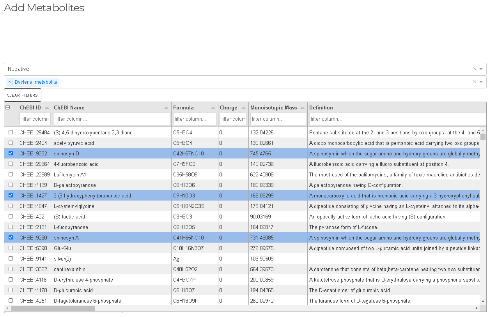

## Optimization

 - Optimize retention times for all peaks or individual peaks
 - Preview all peakshapes with quality indicator

Retention times (RT) depend on the experiment and the specific chromatographic column used. 
Additionally, aging of the column leads to drifts in RT that have to be accounted for. 
The tools in the peak optimization tab can be used to quickly review all  peak definitions in 
the presently loaded peaklist. 

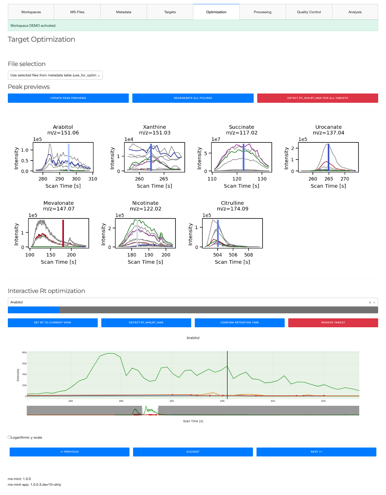

The `GENERATE PEAK PREVIEWS` generates a preview of all peak definitions and plots the
corresponding chromatograms for all files. The peaks can be reviewed and modified one by one
with the interactive tool. `FIND CLOSEST PEAKS` iterates through all peak definitions and
identifies the closest peak with respect to the expected RT which is displayed as black vertical line.

### Manual (interactive) peak optimization

  - Optimize individual peaks one by one
  - Find bad peaks
  - Remove peaks from peaklist
  - Set expected retention time

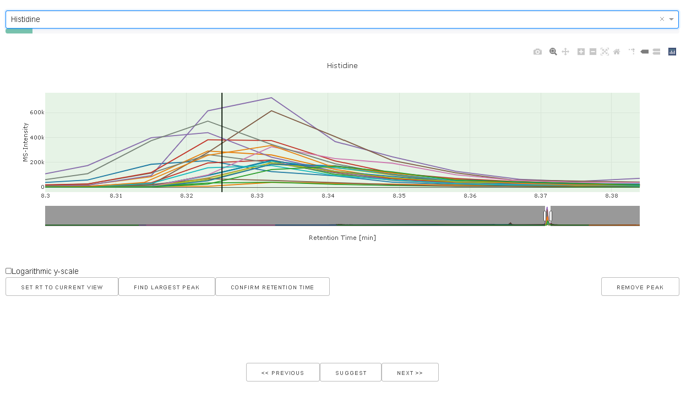

When a peak is selected in the drop down box the chromatograms for the particular mass windows
using the peak width as defined in the peaklist is extracted and displayed. The current rt window
is visualized as green box. `SET RT TO CURRENT VIEW` will set the *rt_min* and *rt_max* values 
to the current view and updated the peaklist accordingly.

## Processing

  - Run MINT (apply the extraction protocol to all files in the workspace)
  - Download results
  - Reset results and start again

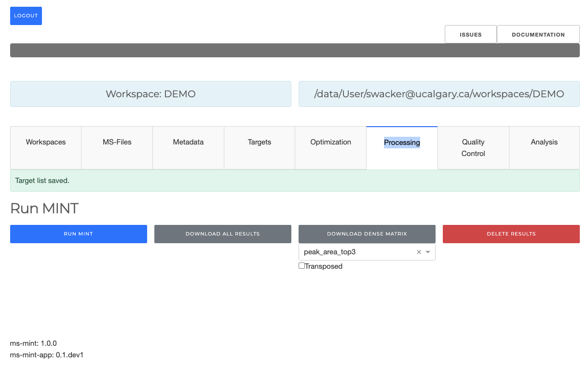

When all peaks look good the data can be processed using `RUN MINT`. This will apply
the current peaklist to the MS-files in the workspace and extract additional properties.
When the results tables are present the results can be explored with the following tabs. 
The generated results can be downloaded with the `DOWNLOAD` button.

- `RUN MINT`: Will process all files in the workspace using the current target list. The progress is displayed in the progress bar on the top.
- `DOWNLOAD ALL RESULTS`: The generated results can be downloaded in tidy format.
- `DOWNLOAD DENSE MATRIX`: This will download a dense data table with targets as rows and files as columns. The observable used for the cells can be selected in the drop down menu. Optionllay, you can transpose the table, by checking the `Transposed` checkbox.
- `DELETE RESULTS`: Delete results file if present, and start from scratch.

## Quality Control
Analytical visualizations to display a few quality metrics and comparisons. The `m/z drift` compares the observed m/z values with the ones set in the target list. This value will always be lower than the `mz_width` set in the target list for each target. It is one way of evaluating how well the machine is calibrated. Generally speaking, values between [-5, 5] are acceptible, but it depends on the specific assay and experiment.  

The graphs are categorized by `sample_type` set in the Metadata tab. You should have some quality control, or calibration samples with known metabolite composition, to be able to make judgements about the quality.

The second plot breaks down the `m/z drift` by target, to see how the calibration varies between targets.

The PCA (Principal Components Analysis) plot shows a PCA using `peak_area_top3`. You can compare different groups of samples as set in the `sample_types` column in the Metadata tab.

The final plot displays peak shapes of a random sample of files for all targets. To change the sample, you can refresh this page. 

## Analysis
After running MINT the results can be downloaed or analysed using the provided tools.
For quality control purposes histograms and boxplots can be generated in the 
quality control tab. The interactive heatmap tool can be used to explore the results data after `RUN MINT`
has been exectuted. The tool allows to explore the generated data in from of heatmaps.

## Selections and transformations
  - Include/exclude file types (based on `Type` column in metadata)
  - Include/exclude peak labels for analysis
  - Set file sorting (e.g. by name, by batch etc.)
  - Select group-by column for coloring and statistics

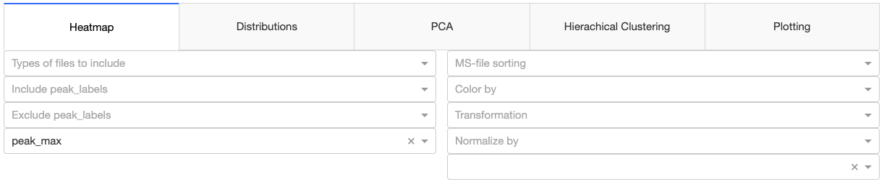

- `Types of files to include`: Uses the `sample_types` column in the Metadata tab to select files. If nothing is selected, all files are included. 
- `Include peak_labels`: Targets to include. If nothing is selected all targets are included.
- `Exclude peak_labels`: Targets to exclude. If nothing is selected no target is excluded.
- `Variable to plot`: This determines which column to run the analysis on. For example, you can set this to `peak_mass_diff_50pc` to analyse the instrument calibration. The default is `peak_area_top3`.
- `MS-file sorting`: Before plotting sets the order of the MS-files in the underlying dataframe. This will change the order of files in some plots.
- `Color by`: PCA and `Plotting` tool can use a categoric or numeric column to color code samples. Some plots (e.g. Hierarchical clustering tool are unaffected).
- `Transformation`: The values can be log transformed before subjected to normalization. If nothing is selected, the raw values are used.
- `Scaling group(s)`: Column or selection of columns to group the data and apply the normalization function in the dropdown menu for each group. If you want to z-scores for each target, you need to select `peak_label` here, and in the dropdown menu 'Standard scaling`.
- `Scaling technique`: You can choose between standard scaling, min-max scaling, or robust scaling, or no scaling (if nothing is selected).

### Scaling Techniques

#### 1. Standard Scaling

**Standard scaling** (also known as z-score normalization) transforms the data such that the mean of each feature becomes 0 and the standard deviation becomes 1. This is useful when the features have different units or magnitudes, as it ensures they are on the same scale.

The formula for standard scaling is:

    z = (x - mean) / standard_deviation

Where:
- `x` is the original value.
- `mean` is the mean of the feature.
- `standard_deviation` is the standard deviation of the feature.

#### 2. Robust Scaling

**Robust scaling** is used to scale features using statistics that are robust to outliers. This scaling technique uses the median and the interquartile range (IQR) instead of the mean and standard deviation, making it more suitable for datasets with outliers.

The formula for robust scaling is:

    x_scaled = (x - median) / IQR

Where:
- `x` is the original value.
- `median` is the median of the feature.
- `IQR` is the interquartile range of the feature (IQR = Q3 - Q1).

#### 3. Min-Max Scaling

**Min-max scaling** (also known as normalization) transforms the data to fit within a the range [0, 1]. This scaling techique is useful when you want to preserve the relationships within the data, but want to adjust the scale.

The formula for min-max scaling is:

    x_scaled = (x - x_min) / (x_max - x_min)

Where:
- `x` is the original value.
- `x_min` is the minimum value of the feature.
- `x_max` is the maximum value of the feature.

## Heatmap
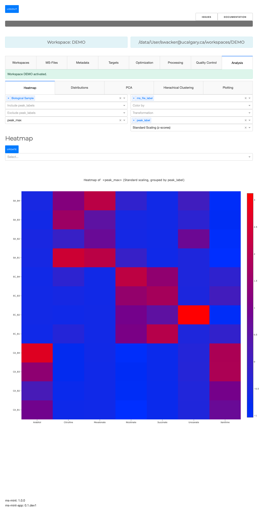

The first dropdown menu allows to include certain file types e.g. biological samples rather than quality control samples.
The second dropdown menu distinguishes the how the heatmap is generated. 

- `Cluster`: Cluster rows with hierachical clustering.  
- `Dendrogram`: Plots a dendrogram instead of row labels (only in combination with `Cluster`).
- `Transpose`: Switch columns and rows.
- `Correlation`: Calculate pearson correlation between columns.
- `Show in new tab`: The figure will be generated in a new independent tab. That way multiple heatmaps can be generated at the same time. This may only work when you serve MINT locally, since the plot is served on a different port. If the app becomes unresponsive to changes, reload the tab. 

### Example: Plot correlation between metabolites using scaled peak_area_top3 values

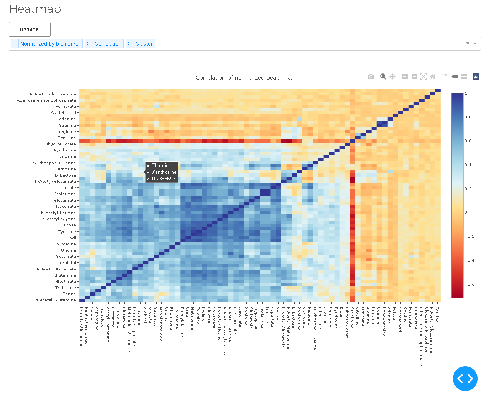

## Distributions

  - Plot histograms
  - Density distributions
  - Boxplots

### Example: Box-plot of scaled peak_area_top3 values by metabolite

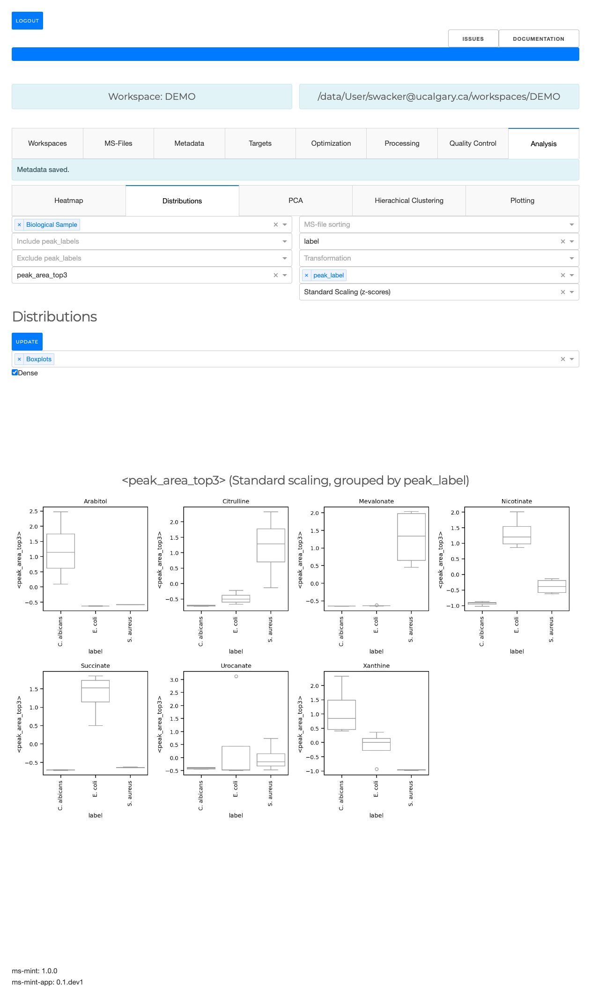

The MS-files can be grouped based on the values in the metadata table. If nothing
is selected the data will not be grouped in order to plot the overall distribution.
The second dropdown menu allows to select one or multple kinds of graphs that 
to generate. The third dropdown menu allows to include certain file types. 
For example, the analysis can be limited to only the biological samples if such a 
type has been defined in the type column of the metadata table. 

The checkbox can be used to create a dense view. If the box is unchecked the output will be visually grouped into an individual section for each metabolite.

The plots are interactive. You can switch off labels, zoom in on particular areas of interest, or hover the mouse cursor over a datapoint to get more information about underlying sample and/or target.

## Principal Component Analysis (PCA)

 - Perform Principal Component Analysis (PCA)
 - Plot projections to first N principal components
 - Contributions of original variables to each component.

Principal Component Analysis (PCA) is a statistical technique used to reduce the dimensionality of a dataset while preserving as much variability (information) as possible. It transforms the original data into a new coordinate system where the greatest variances by any projection of the data come to lie on the first coordinates called principal components.

**Principal Components**

  - **Definition**: Principal components are the new set of axes in the transformed feature space. They are linear combinations of the original features.
  - **Purpose**: These components are ordered by the amount of variance they explain from the data. The first principal component explains the most variance, the second the second most, and so on.

**Cumulative Explained Variance**

  - **Definition**: The cumulative explained variance is the sum of the explained variances of the principal components up to a given component. It indicates the proportion of the total variance in the dataset that is accounted for by the principal components.
  - **Purpose**: This helps in deciding how many principal components to keep by showing how much of the total variance is captured as you include more components.

**PCA Loadings**

  - **Definition**: PCA loadings represent the coefficients of the linear combination of the original variables that define each principal component. They indicate the contribution of each original feature to the principal components.
  - **Purpose**: Loadings help in understanding the importance of each feature in the principal components and how they contribute to the variance explained by each component.

### Example: PCA colored by sample label (i.e. biological organism) using z-scores
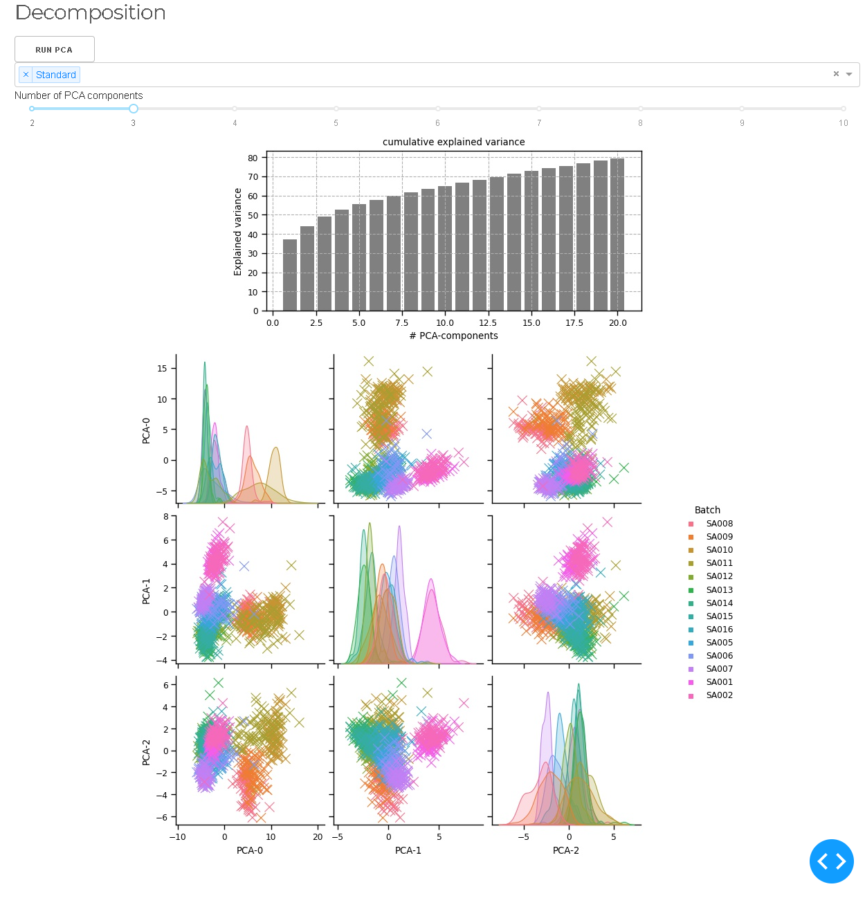

## Hierarchical clustering
Hierarchical clustering is a technique for cluster analysis that seeks to build a hierarchy of clusters. It can be divided into two main types: **agglomerative** and **divisive**.  MINT uses agglomerative hierarchical clustering, also known as bottom-up clustering, starts with each data point as a separate cluster and iteratively merges the closest clusters until all points are in a single cluster or a stopping criterion is met.

### Steps for Agglomerative Clustering
1. **Initialization**: Start with each data point as its own cluster.
2. **Distance Calculation**: Compute the pairwise distance between all clusters.
3. **Merge Closest Clusters**: Find the two closest clusters and merge them into a single cluster.
4. **Update Distances**: Recalculate the distances between the new cluster and all other clusters.
5. **Repeat**: Repeat steps 3 and 4 until all data points are in a single cluster or the desired number of clusters is achieved.

### Dendrogram

The output of hierarchical clustering is often visualized using a dendrogram, which is a tree-like diagram that shows the arrangement of clusters and their hierarchical relationships. Each branch of the dendrogram represents a merge or split, and the height of the branches indicates the distance or dissimilarity between clusters.

### Example: Hirarchical clustering with different metrics using z-scores (for each metabolite)

## Plotting
With great power comes great responsibility. The plotting tool can generate impressive, and very complex plots, but it can be a bit overwhelming in the beginning. It uses the [Seaborn](http://seaborn.pydata.org/) library under the hood. Familiarity, with this library can help understanding what the different settings are doing. We recommend starting with a basic plot and then increase its complexity stepwisely.

- Bar plots
- Violin plots
- Boxen plot
- Scatter plots
- and more...

### Example: Compare log2 transformed and then z-scaled peak_area_top3 for between LC columns for all metabolites.

