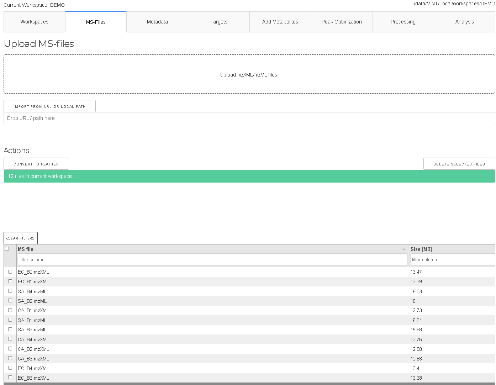
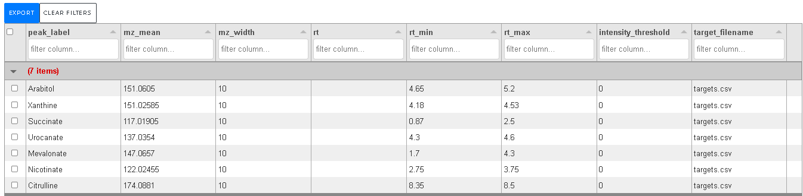
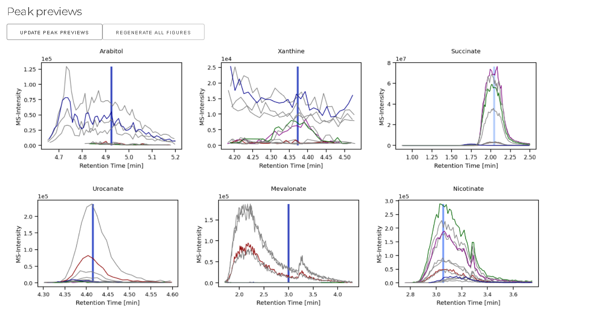
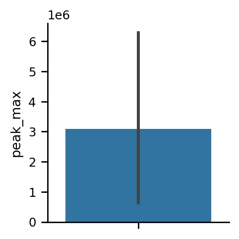
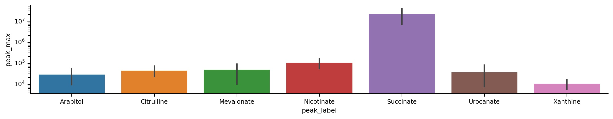
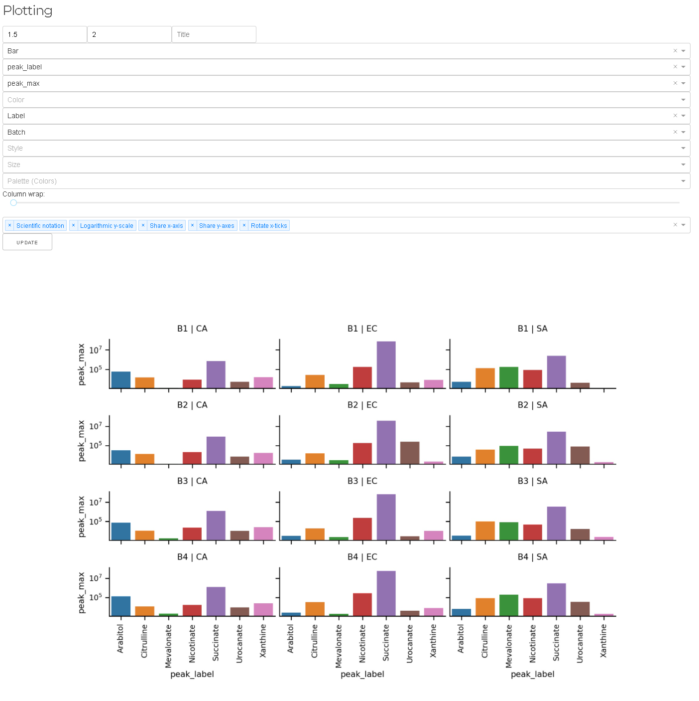
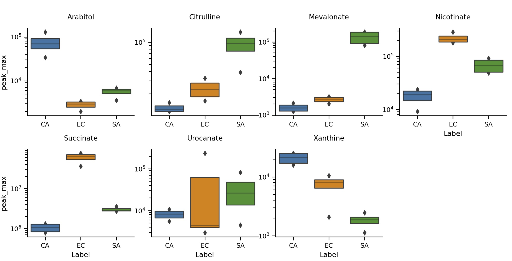

# Quickstart Guide for ms-mint-app
Welcome to the ms-mint-app quickstart guide! This guide will help you get up and running with the application, allowing you to start analyzing mass spectrometry data efficiently. Follow the steps below to install the app, create a workspace, and begin processing your data.

## 1. Install `ms-mint-app`

If you know how to use `pip` run:

```
pip install ms-mint-app
```

or follow the instruction [here](https://lewisresearchgroup.github.io/ms-mint-app/install/).

Then start the application with

```
Mint
```

or, if you have a prefered directory for data you can specify it with `--data-dir` e.g.:

```
Mint --data-dir /data
```

The application will take a while until it starts up. In the mean time the browser window will show

> This site can’t be reached

Just wait a bit until the terminal shows `INFO:waitress:Serving on http://127.0.0.1:9999` and refresh the page.
The application is now served on port `9999` of your local machine.


If you have never started the application before, you will not have any workspaces yet.

## 2. Create a workspace

In the `Workspaces` tab click on the blue button with the label `CREATE WORKSPACE`. A dialogue opens asking you for the name of the future workspace. Type `DEMO` into the text field and click on `CREATE`.


Now you have created your first workspace, but it is empty. We will need some input files to populate it.
You can see which workspace is activated in the light-blue info box:


## 3. Download the demo files

Some demo files are available for download on the `ms-mint` Google-Drive. Go on and download the files from [Google Drive](https://drive.google.com/drive/folders/1U4xMy5lfETk93sSVXPI79cCWyIMcAjeZ?usp=drive_link) and extract the archive.

You will find two `csv` files and 12 `mzXML` and/or `mzML` files. 

```
.
├── README.md
├── metadata
│   └── metadata.csv
├── ms-files
│   ├── CA_B1.mzXML
│   ├── CA_B2.mzXML
│   ├── CA_B3.mzXML
│   ├── CA_B4.mzXML
│   ├── EC_B1.mzXML
│   ├── EC_B2.mzXML
│   ├── EC_B3.mzXML
│   ├── EC_B4.mzXML
│   ├── SA_B1.mzML
│   ├── SA_B2.mzML
│   ├── SA_B3.mzML
│   └── SA_B4.mzML
└── targets
    └── targets.csv

4 directories, 15 files
```

- A folder with 12 mass-spectrometry (MS) files from microbial samples. We have four files for each _Staphylococcus aureus_ (SA), _Escherichia coli_ (EC), and _Candida albicans_ (CA).
Each file belongs to one of four batches (B1-B4). 
- `metadata.csv` contains this information in tabular format. Setting up the metadata for your project is essential. 
- `targets.csv` contains the extraction lists. The identification of the metabolites has been done before, so we know where the metabolites appear in the MS data.

## 4. Upload LCMS files 

Switch to `MS-Files` tab and upload the 12 MS files, by either using the Explorer/Finder to the Upload field, or by clicking on the upload field and selecting the files in the dialogue box that opens. Wait until all files are uploaded:



To speed up future processing you can now convert these files to the `.feather` format, by selecting all files and clicking on "CONVERT SELECTED FILES TO FEATHER".

## 5. Add metadata

Switch to `Metadata` and upload `metadata.csv`. This will populate the table with important information.


This file contains critical information about your samples, and setting up the metadata accurately and meticulously is essential. 
The metadata table is a cornerstone for downstream processes in `ms-mint` and should not be omitted. 
Properly configured metadata enhances the quality and precision of your results, making it a vital component of your workflow.

| Column Name           | Description                                                                                                                                   |
|-----------------------|-----------------------------------------------------------------------------------------------------------------------------------------------|
| `ms_file_label`       | The label of the mass spectrometry file.                                                                                                      |
| `color`               | Color coding for visual identification.                                                                                                       |
| `use_for_optimization`| Boolean value indicating if the file is used in peak optimization.                                                                             |
| `in_analysis`         | Indicates if the sample is included in the analysis.                                                                                          |
| `label`               | Group of the sample (e.g., treatment group vs. control group).                                                                                |
| `sample_type`         | Type of the sample, default is `Biological Sample`, other labels could be `Standard Sample` or `Quality Control`.                             |
| `run_order`           | Order in which the samples were processed (1-N).                                                                                              |
| `plate`               | Batch ID, for example, the plate if samples come from multiple plates.                                                                        |
| `plate_row`           | Row location of the sample on the plate (e.g., 1-12 for a 96-well plate).                                                                     |
| `plate_column`        | Column location of the sample on the plate (e.g., A-H for a 96-well plate).                                                                   |
| `ms_column`           | Mass spectrometry column information.                                                                                                         |
| `ionization_mode`     | Mode of ionization used in the mass spectrometry.                                                                                             |


## 5. Add targets (metabolites)
Switch to `Targets` and upload `MINT-targets.csv`.


This is the data extraction protocol. This determines what data is extracted from the files. The same protocol is applied to all files. No fitting or peak optimization is done. 
MINT therefore requires a very stable chromatographic column and stable retention times for all files in a workspace. 

## 6. Optimize retention times
Switch to `Peak Optimization` tab and select `Use all files` in the `File selection` menu. Normally, especially for large datasets, you should select a small representative set of samples including standards (with known concentrations of the target metabolites). The peak optimization takes longer the more files are used for it and the more targets are defined. 'Click on `UPDATE PEAK PREVIEWS`. 



This will show you the shapes of the data in the selected regions as an overview. This is a great way to validate that your target parameters are correct. 
However, you have to make sure that the metabolite you are looking for is present in the files. That is why you should always add some standard samples.
The colors in the plots correspond to the colors in the metadata table.

You can use the interactive tool below to optimize the retention time for each target manually. You can do that by zooming in towards the area that you want to select as peak and then click on `SET RT TO CURRENT VIEW`. The green area is what is currently selected as retention time (RT) range. The black bar is the expected retention time of the peak maximum that you usually know from former experiments. This way you can compare the peak with older experiments. To set the expected RT to the middle of the current window press `CONFIRM RETENTION TIME`. If the target is not present in any of the files, you can and should remove it from the target list by clicking on `REMOVE TARGET`. 


- if you are happy with the peak shapes you can proceed to `Processing`.

## 7. Process the data

Switch to `Processing` and start the data extraction with `Run MINT`


The extraction process is done when you get a green notification `Finished running MINT`.
Now, you can download the results in long-format or the dense peak_max values. 
The tidy format contains all results, while the `DENSE PEAK_MAX` only contians the `peak_max` values as a matrix. 


## 8. Analyze the results.

Once the results are generated the 'Heatmap` tab will show an interactive heatmap.
You can change the size of the heatmap by changing your browser window and `UPDATE` the plot.
The heatmap shows the `peak_max` values. The dropdown menu provides some options.

## 9. Switch to `Analysis/Plotting`

The plotting tool is very powerful, but requires some practise. It is a wrapper of the powerful seaborn API. 
Let's create a few simple visualizations.




And click on `Update`. A very simple bar-graph is shown, and we will gradually make it more complex. 
This simple bar graph shows the average `peak_max` value across the whole dataset for all targets. 

### a) select `peak_label` for the `X` axis.
### b) set aspect-ratio to 5.
### c) select `Logarithmic y-scale` in the dropdown options.
### d) click on `UPDATE`.



### e) set figure height to `1.5` and aspect ratio to `2`.
### e) set `Column` to `Label`.
### f) set `Row` to `Batch`.



This way you can look at the whole dataset at once, sliced by `Batch` and `Label`

## Exercise: Try to create the following plot:



[Read more](gui.md)
